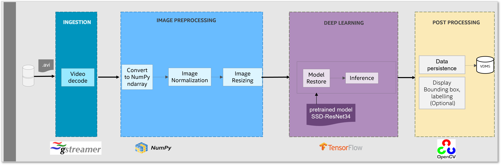

# **Video Streamer**
## Overview

The video streamer pipeline is designed to mimic real-time video analytics. Real-time data is provided to an inference endpoint that executes single-shot object detection. The metadata created during inference is then uploaded to a database for curation.

## How it works

* It's a Gstreamer Pipeline based multimedia framework.
  Gstreamer elements are chained to create a pipeline where Gstreamer handles the flow of metadata associated with the media.

* Use TensorFlow to Inference. Inference is implemented as a plugin of Gstreamer.

* OpenCV Image preprocessing (normalization, resize) and draw Bounding box, labelling
* VDMS to store uploading metadata to database
* The workflow uses BF16/INT8 precision in SPR which speeds up the inference time using Intel® AMX, without noticeable loss in accuracy when compared to FP32 precision (using Intel® AVX-512).

Video streamer data flow


## Get started
### **Prerequisites**
#### Download the repo
Clone [Main Repository](https://github.com/intel/video-streamer) repository into your working directory.
```
git clone https://github.com/intel/video-streamer .
git checkout v1.0.0
```
#### Download the Video File and Models
```
wget https://github.com/intel-iot-devkit/sample-videos/raw/master/classroom.mp4 -O classroom.mp4
export VIDEO=$(basename $(pwd)/classroom.mp4)
mkdir models
wget https://storage.googleapis.com/intel-optimized-tensorflow/models/v1_8/ssd_resnet34_fp32_1200x1200_pretrained_model.pb -P models
wget https://storage.googleapis.com/intel-optimized-tensorflow/models/v1_8/ssd_resnet34_int8_1200x1200_pretrained_model.pb -P models
```
### **Docker**
Below setup and how-to-run sessions are for users who want to use provided docker image.  
For bare metal environment, please go to [bare metal session](#bare-metal).
#### Setup 

##### Pull Docker Images
```
docker pull vuiseng9/intellabs-vdms:demo-191220
docker pull intel/ai-workflows:video-streamer
```
#### How to run 

(Optional) Export related proxy into docker environment.
```
export DOCKER_RUN_ENVS="-e ftp_proxy=${ftp_proxy} \ 
  -e FTP_PROXY=${FTP_PROXY} -e http_proxy=${http_proxy} \ 
  -e HTTP_PROXY=${HTTP_PROXY} -e https_proxy=${https_proxy} \ 
  -e HTTPS_PROXY=${HTTPS_PROXY} -e no_proxy=${no_proxy} \ 
  -e NO_PROXY=${NO_PROXY} -e socks_proxy=${socks_proxy} \ 
  -e SOCKS_PROXY=${SOCKS_PROXY}"
```
To run the pipeline, follow below instructions outside of docker instance. 

* Initiate the VDMS inference endpoint.

```
numactl --physcpubind=52-55 --membind=1 docker run --net=host -d vuiseng9/intellabs-vdms:demo-191220
```

* Initiate the Video-Streamer service.

```
#Create output directory to store results of inference
export OUTPUT_DIR=/output
#Run the quick start script using the docker image
docker run -a stdout $DOCKER_RUN_ENVS \
  --env VIDEO_FILE=/workspace/video-streamer/${VIDEO}  \
  --rm -it --privileged --net=host -p 55555:55555  \
  --volume $(pwd):/workspace/video-streamer  \
  --volume ${OUTPUT_DIR}:${OUTPUT_DIR}  \
  -w /workspace/video-streamer  \
  intel/ai-workflows:video-streamer  \
  /bin/bash ./benchmark.sh && cp -r ../*.txt ${OUTPUT_DIR}
```

### **Bare Metal**
Below setup and how-to-run sessions are for users who want to use bare metal environment.  
For docker environment, please go to [docker session](#docker).
#### Setup 
Please go to the directory where you cloned the repo, follow commands to install required software.

```
conda create -n vdms-test python=3.8
conda activate vdms-test
./install.sh
```

By default, this will install intel-tensorflow-avx512.  If it is necessary to run the workflow using a specific TensorFlow, please update it in `requirements.txt`

### Configuration

* config/pipeline-settings for pipeline setting
Modify the parameter `gst_plugin_dir` and `video_path` to fit your Gstreamer plugin directory and input video path.

For example, we have `test.mp4` in `dataset` folder and gstreamer installed in `/home/test_usr/miniconda3/envs/vdms-test`. So we set as following:
```
video_path=dataset/test.mp4
gst_plugin_dir=/home/test_usr/miniconda3/envs/vdms-test/lib/gstreamer-1.0
```
* config/settings.yaml for inference setting
Customize to choose FP32, AMPBF16 or INT8 for inference.

CPU Optimization settings are found in two files:

`config/pipeline-settings`
1. cores_per_pipeline
This controls the number of CPU cores to run in the whole pipeline.

`config/settings.yaml`
1. inter_op_parallelism : "2"
2. intra_op_parallelism : "4"

This controls TensorFlow thread settings. 
* inter_op_parallelism: the number of threads used by independent non-blocking operations in TensorFlow.
* intra_op_parallelism: execution of an individual operation can be parallelized on a pool of threads in TensorFlow. `intra_op_parallelism` contorls the maximum thread number of the pool.

### How to run

`run.sh` is configured to accept a single input parameter which defines how many separate instances of the gstreamer pipelines to run. Each OpenMP thread from a given instance is pinned to a physical CPU core. I.e, when running four pipelines with OMP_NUM_THREADS=4
|*Pipeline*|*Cores*|*Memory*|
| ---- | ---- | ---- |
|1| 0-3| Local |
|2| 4-7| Local |
|3| 8-11| Local |
|4|12-15| Local |

It is very important that the pipelines don't overlap numa domains or any other hardware non-uniformity.  These values must be updated for each core architecture to get optimum performance.

For launching the workload using a single instance, use the following command:
```
./run.sh 1
```

For launching 14 instances with 4 cores per instance on a dual socket Xeon 8280, just run
```
./run.sh 14
```

# Recommended Hardware
The hardware below is recommended for use with this reference implementation.

| Recommended Hardware	| Precision |
| ---- | ---- |
| * Intel® 4th Gen Xeon® Scalable Performance processors |	INT8 |
| * Intel® 4th Gen Xeon® Scalable Performance processors |	BF16 |

# Useful Resources
[Intel® AI Analytics Toolkit (AI Kit)](https://www.intel.com/content/www/us/en/developer/tools/oneapi/ai-analytics-toolkit.html)

# Support
Video Streamer tracks both bugs and enhancement requests using Github. We welcome input, however, before filing a request, please make sure you do the following: Search the Github issue database.
